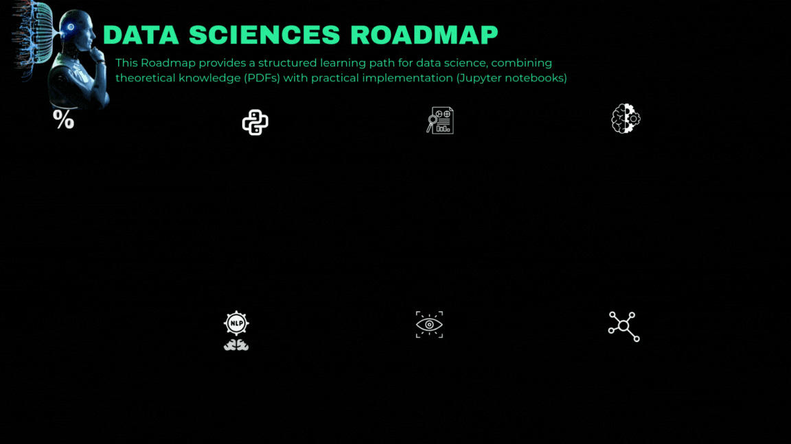

# Data Science Learning Path

This repository provides a structured learning path for data science, combining theoretical knowledge (PDFs) with practical implementation (Jupyter notebooks). The materials progress from fundamental mathematics to advanced AI topics.


*Figure: Visual representation of the learning path from fundamentals to advanced topics*


##  Learning Path

1. **Mathematics Foundation**
   - [Linear Algebra](linear_Algebra.pdf) (PDF)
   - [Differential Calculus](differential_calculs_course%20(1).pdf) (PDF)
   - [Statistics & Probability](stats_proba.pdf) (PDF)

2. **Programming & Data Handling**
   - [Python Basics](python_basics.ipynb) (Notebook)
   - [NumPy](numpy.ipynb) (Notebook)
   - [Pandas](pandas.ipynb) (Notebook)
   - [Data Visualization](data_visualisation.ipynb) (Notebook)
   - [EDA & Data Cleaning](eda&data%20cleaning.ipynb) (Notebook)

3. **Machine Learning**
   - [Machine Learning Theory](machine_learning.pdf) (PDF)
   - [scikit-learn](scikit-learn.ipynb) (Notebook)
   - [Machine Learning Project](machine_learning_project.ipynb) (Notebook)

4. **Advanced Topics**
   - [Deep Learning Theory](deep_learning.pdf) (PDF)
   - [Deep Learning](deep_learning.ipynb) (Notebook)
   - [NLP Theory](nlp.pdf) (PDF)
   - [NLP](nlp.ipynb) (Notebook)
   - [Computer Vision Theory](computer_vision.pdf) (PDF)
   - [Computer Vision](computer_vision.ipynb) (Notebook)

## Python Basics
- Variables and Data Types
- Control Flow (if-else, loops)
- Functions and Modules
- Object-Oriented Programming
- File I/O Operations
- Error Handling

## NumPy
- NumPy Arrays
- Array Operations
- Indexing and Slicing
- Broadcasting
- Linear Algebra Operations
- Random Number Generation

## Pandas
- Series and DataFrames
- Data Loading and Saving
- Data Selection and Filtering
- Handling Missing Data
- GroupBy Operations
- Merging and Joining
- Time Series Analysis

## Data Visualization
- Matplotlib Fundamentals
- Line Plots, Bar Charts, Histograms
- Scatter Plots and Heatmaps
- Customizing Visualizations
- Statistical Plots
- Interactive Visualizations

## EDA & Data Cleaning
- Data Profiling
- Handling Missing Values
- Outlier Detection
- Feature Engineering
- Data Transformation
- Correlation Analysis

## Machine Learning
- Supervised vs Unsupervised Learning
- Train-Test Split
- Model Evaluation Metrics
- Linear and Logistic Regression
- Decision Trees and Random Forests
- Support Vector Machines
- Model Tuning and Cross-Validation

## Deep Learning
- Neural Networks Fundamentals
- Activation Functions
- Backpropagation
- Optimization Algorithms
- Regularization Techniques
- Introduction to TensorFlow/Keras
- Building and Training Neural Networks

## Natural Language Processing (NLP)
- Text Preprocessing
- Bag of Words
- TF-IDF
- Word Embeddings
- Sentiment Analysis
- Text Classification
- Sequence Models

## Computer Vision
- Image Processing Basics
- OpenCV Fundamentals
- Image Filtering and Transformations
- Feature Detection
- Object Detection
- Image Classification
- Convolutional Neural Networks (CNNs)
- Transfer Learning

## Machine Learning Project
- End-to-End ML Project
- Problem Definition
- Data Collection and Preparation
- Model Building and Evaluation
- Model Deployment
- Performance Monitoring

## Prerequisites
- Python 3.7+
- Jupyter Notebook
- Required Python packages (install using `pip install -r requirements.txt`)

## Getting Started
1. Clone this repository
2. Install the required packages:
   ```
   pip install -r requirements.txt
   ```
3. Launch Jupyter Notebook:
   ```
   jupyter notebook
   ```
4. Start with `python_basics.ipynb` and progress through the notebooks in order.

## Detailed Course Structure

### 1. Mathematics Foundation
- **Linear Algebra**
  - Vectors and Matrices
  - Matrix Operations
  - Eigenvalues and Eigenvectors
  - Applications in Data Science

- **Differential Calculus**
  - Derivatives and Gradients
  - Optimization Problems
  - Gradient Descent
  - Applications in Machine Learning

- **Statistics & Probability**
  - Descriptive Statistics
  - Probability Distributions
  - Hypothesis Testing
  - Bayesian Statistics

### 2. Programming & Data Handling
- **Python Basics**
  - Data Types and Structures
  - Control Flow
  - Functions and Modules
  - Object-Oriented Programming

- **Data Processing**
  - NumPy for Numerical Computing
  - Pandas for Data Manipulation
  - Data Visualization with Matplotlib/Seaborn
  - Data Cleaning and Preprocessing

### 3. Machine Learning
- **Theoretical Foundations**
  - Supervised vs Unsupervised Learning
  - Model Evaluation
  - Feature Engineering
  - Model Tuning

- **Practical Implementation**
  - scikit-learn Workflow
  - End-to-End ML Project
  - Model Deployment Considerations

### 4. Advanced Topics
- **Deep Learning**
  - Neural Networks
  - CNNs and RNNs
  - Transfer Learning
  - Model Optimization

- **NLP**
  - Text Processing
  - Word Embeddings
  - Sequence Models
  - Transformers

- **Computer Vision**
  - Image Processing
  - Feature Detection
  - Object Recognition
  - Image Generation

## 🤝 Contributing
Contributions are welcome! Please feel free to submit a Pull Request.

## 📄 License
This project is licensed under the MIT License - see the LICENSE file for details.

## 📂 Dataset
- The repository includes sample datasets in the root directory:
  - `Housing.csv` - Housing price dataset
  - `loan_approval_dataset.csv` - Loan approval dataset
  - `house_prices_with_issues.csv` - Dataset with common data quality issues

## �📧 Contact
For any questions or feedback, please open an issue in this repository.
